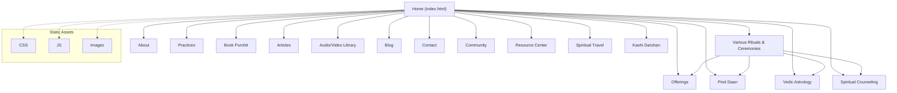

```mermaid
graph TD
    home["Home (index.html)"] --> about["About"]
    home --> practices["Practices"]
    home --> offerings["Offerings"]
    home --> bookpurohit["Book Purohit"]
    home --> articles["Articles"]
    home --> audio["Audio/Video Library"]
    home --> blog["Blog"]
    home --> contact["Contact"]
    home --> community["Community"]
    home --> resources["Resource Center"]
    home --> travel["Spiritual Travel"]
    home --> kashi["Kashi Darshan"]
    home --> pinddaan["Pind Daan"]
    home --> astrology["Vedic Astrology"]
    home --> counseling["Spiritual Counseling"]
    home --> rituals["Various Rituals & Ceremonies"]

    rituals --> offerings
    rituals --> pinddaan
    rituals --> astrology
    rituals --> counseling

    subgraph "Static Assets"
        css["CSS"]
        js["JS"]
        images["Images"]
    end

    home -.-> css
    home -.-> js
    home -.-> images
```
